# App Server Architecture

**Created by**

Juan Carlos Leal Cruz

## Laboratory Overview
This repository contains a Java web server and a lightweight IoC framework. It demonstrates serving HTML pages and PNG images, dynamically loading POJOs, and handling routes with annotations like `@RestController`, `@GetMapping`, and `@RequestParam`. Included are example web applications that showcase the server’s capabilities and how to build modular Java web apps using reflection and IoC principles.

### **Prerequisites**
- `JDK`: 17 or higher
- `Apache Maven`

### **Project Structure**
The project is structured as follows:
```text
demo/
├── pom.xml
└── src/
    └── main/
    │   ├── java/
    │   │   └── org/
    │   │       └── example/
    │   │           └── demo/
    │   │               ├── api/
    │   │               │  ├── Request.java
    │   │               │  ├── RequestParam.java
    │   │               │  └── Response.java
    │   │               ├── server/
    │   │               │   ├── HttpServer.java
    │   │               │   └── MicroSpringBoot.java
    │   │               ├── DemoApplication.java
    │   │               ├── GetMapping.java
    │   │               ├── GreetingController.java
    │   │               ├── HelloController.java
    │   │               ├── InvokeMain.java
    │   │               ├── ReflexionNavigator.java
    │   │               └── RestController.java
    │   └── resources/
    │       └── www/
    │           ├── index.html
    │           └── logo.jpg
    └── test/
        └── java/
            ├── FrameworkReflectionTest.java
            └── RequestTest.java
```

### **How to run the lab**
1. **Clone the repository**
   ```bash
   git clone <repository-url>
   ```
2. **Build the laboratory**
   ```bash
   mvn clean compile
   ```
3. **Start the server**

   You can start the framework in its final "Auto-Discovery" mode without passing any parameters:
   ```bash
   java -cp target/classes org.example.demo.server.MicroSpringBoot
   ```

   Or you can use the first version of it, passing an argument with the following command:
   ```bash
   java -cp target/classes org.example.demo.server.MicroSpringBoot org.example.demo.HelloController
   ```

   To stop the application just use Ctrl + C in your terminal.
5. **Test the Endpoints**

   Once the server indicates it is listening on port 8080, open your browser and navigate to the following URLs to test the framework:
   - Static HTML: http://localhost:8080/index.html
   - Static PNG: http://localhost:8080/logo.png
   - Basic REST Endpoint: http://localhost:8080
   - Basic REST Endpoint (Say Hello): http://localhost:8080/hello
   - Basic REST Endpoint (Pi values): http://localhost:8080/pi
   - Dynamic Parameter Injection: http://localhost:8080/greeting?name=Juan

6. **Running the Tests**
   
   If you want to perform the tests created for the lab, you can use the following command:
   ```bash
   mvn clean test
   ```
   
   Or you can manually use the ID to run all the tests.

---

## Lab Requirements Implementation
This lab was built step-by-step to understand how frameworks like Spring Boot work behind the scenes using Java Reflection.

### **1. POJO Loading via Command Line (First Version)**
The first goal was to load a class without hardcoding it into the server. To do this, the `MicroSpringBoot` class takes the name of a class (like `org.example.demo.HelloController`) from the terminal arguments (`args[0]`). It then uses `Class.forName()` to find that class and `newInstance()` to create an object of it while the program is already running. This shows how we can separate the server code from the actual web application code.

### **2. Custom Annotations (@GetMapping & @RestController)**
Next, two notations were created for the server. Once the server loads our class, it uses Reflection (`getDeclaredMethods()`) to look at all the methods inside it. If a method has our custom `@GetMapping` annotation, the server reads the path (like `/hello`) and saves it in a `HashMap`. When someone visits that URL in their browser, the server looks up the path in the `HashMap`, runs the corresponding method, and sends the returned `String` back to the browser as an HTTP response.

### **3. Classpath Scanning and Auto-Discovery (Final Version)**
Typing the class name in the terminal every time is annoying, so a scanner was built. Instead of using `args[0]`, the program looks inside the `target/classes` folder where the compiled code lives. It uses a loop to check every single `.class` file. If it finds a class that has the `@RestController` annotation, it automatically loads it and registers its methods. Because it uses a loop, the framework can find and load multiple controllers (like both `HelloController` and `GreetingController`) all by itself.

### **4. Parameter Injection (@RequestParam)**
To make the web app dynamic, we needed a way to read variables from the URL (like `?name=Student`).A `@RequestParam` annotation was created for this. When a request comes in, the server splits the URL to find any query parameters. Then, using Reflection, it looks at the variables required by the Java method. If the method asks for a parameter, the server grabs the value from the URL and passes it to the method. If the URL doesn't have it, it uses the `defaultValue` we set in the annotation.

### **5. Stateful Components (GreetingController)**
The lab instructions included a `GreetingController` with an `AtomicLong` counter and a `template` string. In the original code snippet provided in the lab, these variables weren't actually being returned to the user, so the code was updated in order for the return statement to include them. 

Now, every time you refresh the `/greeting` page, the counter goes up (Ex: "Hello, Juan! (Request #1)", then "(Request #2)"). This is a very important detail because it proves that the framework creates one instance of the controller and keeps it alive in memory across multiple HTTP requests, just like a real framework should. It also proves that the Auto-Discovery scanner can successfully find, load, and manage multiple separate classes (`HelloController` and `GreetingController`) at the same time without breaking any routes.

---

## **Evidences of the Endpoints**
1. **Basic**
   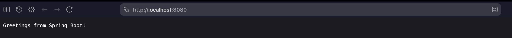

2. **Pi**
   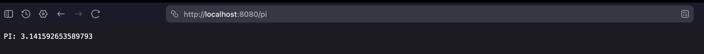

3. **HelloWorld**
   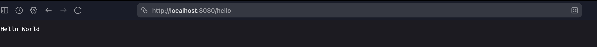

4. **Index.html**
   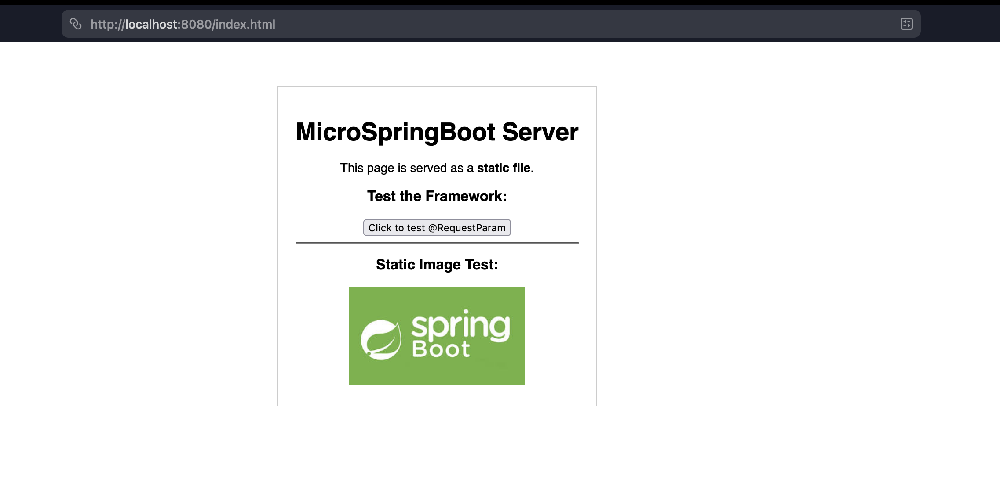

5. **Greeting**
   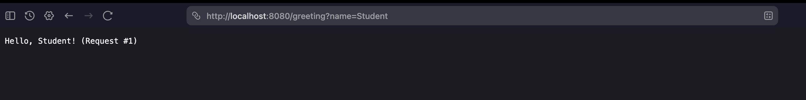
   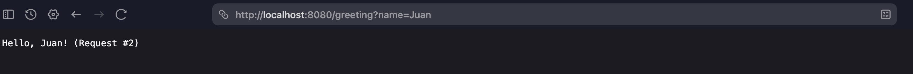

---
## **Testing the Framework**
To guarantee the stability and correctness of the custom framework, a suite of unit tests was developed using JUnit. Because the architecture successfully implements Inversion of Control (IoC), the core logic of the framework can be tested in isolation without needing to start the physical socket server.

The test suite focuses on two main areas:
- **Request Parsing (`RequestTest.java`):** Validates the custom `Request` abstraction. It ensures that the server correctly parses and extracts multiple query parameters from a URL (Ex: `?name=Juan&role=Admin`). It also strictly tests edge cases, ensuring the framework gracefully handles empty queries, null values, or malformed strings without crashing.
- **Framework Reflection Logic (`FrameworkReflectionTest.java`):** This suite verifies the internal mechanics of the IoC container. Instead of just checking method outputs, it uses Java Reflection to inspect the metadata of the components. It verifies that `GreetingController` is properly annotated with `@RestController` for the Auto-Discovery scanner to find it, confirms that `@GetMapping` holds the correct URI path data, and ensures that `@RequestParam` successfully retains the `defaultValue` needed for parameter injection.

### Running the Tests
To execute the test suite, ensure you are in the root directory of the project (where the `pom.xml` is located) and run the following Maven command:
```bash
mvn clean test
```
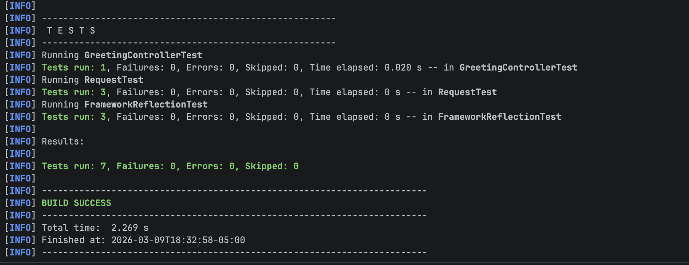


---
## **Web Server Application in AWS**
In order to deploy the Web Server in AWS we used the same instance we created in class, so using the `.pem` key we were able to connect to AWS.

Later on, we proceeded to install some developer tools in order to use the application we created. Here are the following you need to install to upload the project to your instance:
1. We install git in the instance using the following command:
   ```bash
   sudo yum install git -y
   ```

2. Then we install java in order to compile the project using the following command:
   ```bash
   sudo yum install java-17-amazon-corretto-devel -y
   ```

3. Finally we install Maven in order to compile:
   ```bash
   sudo yum install -y apache-maven
   ```
   
After installing all those tools, we can follow the Running Instructions that are listed at the beginning of this README (Clone repo, compile, etc.)

For more information, check the specified section clicking the link:

[How to run the lab](#how-to-run-the-lab)

### **Evidence of AWS Running on the Instance**
#### Connection to the instance
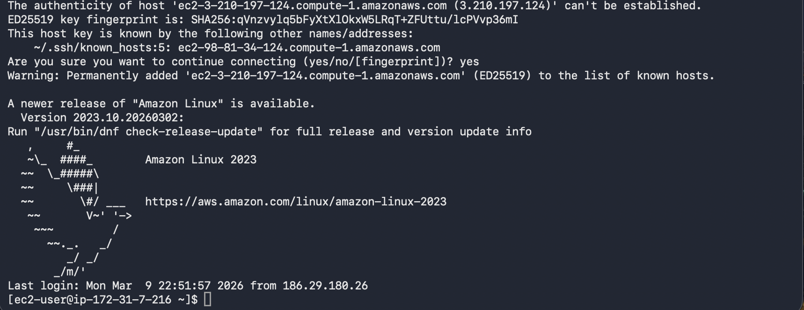
#### Cloning the repository
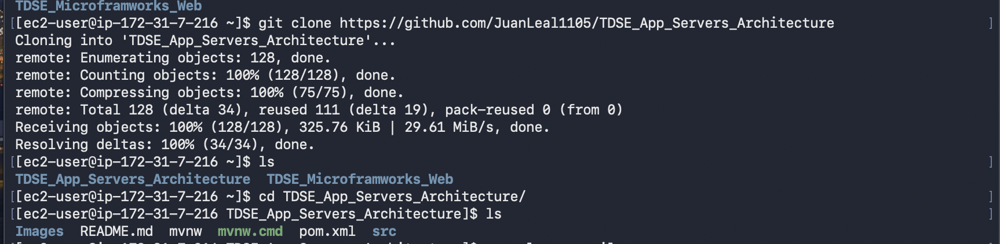
#### Compiling the lab
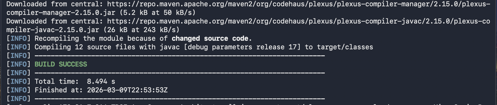
#### Running the lab inside the instace
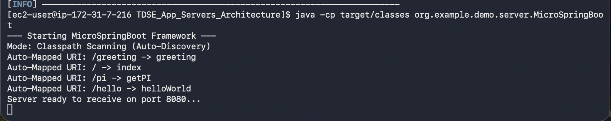
#### Evidence using the Public DNS direction given by AWS
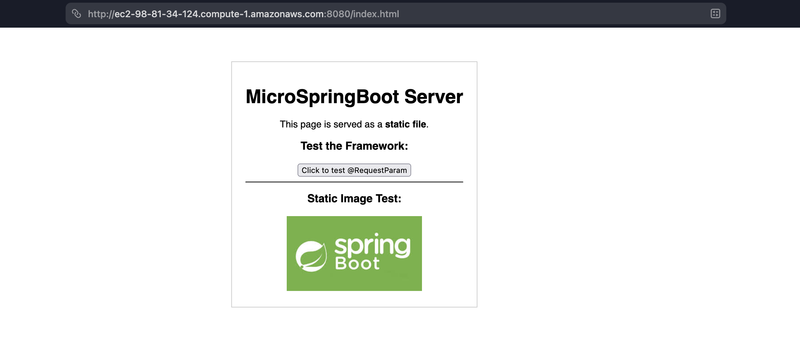
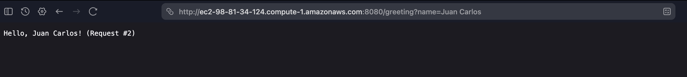
#### Running the Tests on the Instance
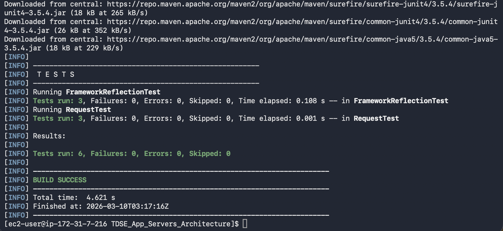
